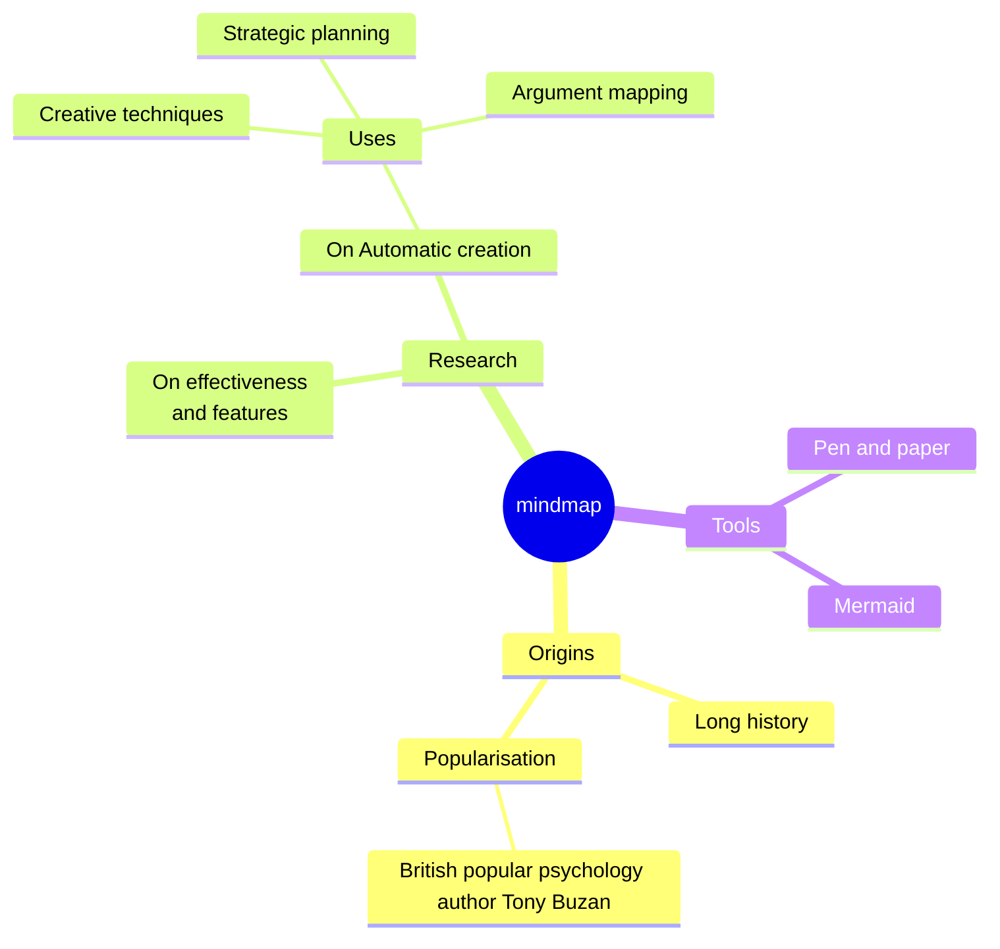

### An example of a mindmap.



## Syntax

The syntax for creating Mindmaps is simple and relies on indentation for setting the levels in the hierarchy.

In the following example you can see how there are 3 different levels. One with starting at the left of the text and another level with two rows starting at the same column, defining the node A. At the end there is one more level where the text is indented further then the previous lines defining the nodes B and C.

```
mindmap
    Root
        A
            B
            C
```
